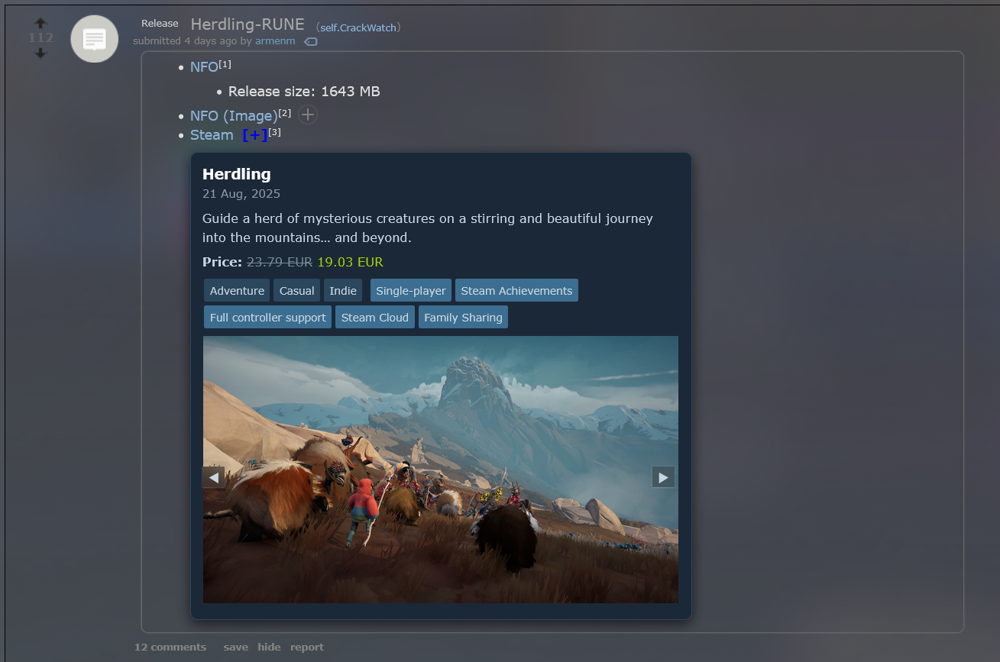

# Steam Link Game Info Expander

A userscript that enhances Steam store links (like those found on Reddit, forums, etc.) by adding an **expandable game info card**.

When you click the little `[+]` next to a Steam link, it shows:

-   🎮 Game title & release date
-   📝 Short description
-   💲 Price (with discount formatting)
-   🏷️ Tags (genres + categories)
-   🎥 Carousel with trailers & screenshots (inline)

All styled to match Steam’s dark bluish theme.

---

## ✨ Features

-   Detects any link to `store.steampowered.com/app/...`
-   Adds a small **[+] expander** button next to it
-   Expands into a card with game info
-   Steam-like theme (dark background, green price, blue tags)
-   Media carousel (screenshots & trailers, with navigation arrows)

---

## 📷 Preview

---

## ⚙️ Installation

1. Install a userscript manager:

    - [Violentmonkey](https://violentmonkey.github.io/) (recommended)
    - [Tampermonkey](https://www.tampermonkey.net/)

2. Add the script:

    - [Click here to install](./SteamLinkGameInfoExpander.user.js)

3. Visit any site with Steam links (e.g. Reddit), and click the `[+]` next to a Steam link.

---

## 🛠️ Technical Details

-   Uses the official Steam **appdetails API**
-   Fetches data via `GM_xmlhttpRequest` (works around CORS issues)
-   Media (trailers/screenshots) are embedded directly in a mini carousel
-   Lightweight, no external dependencies

---

## 📜 License

MIT License — feel free to use, modify, and share.
